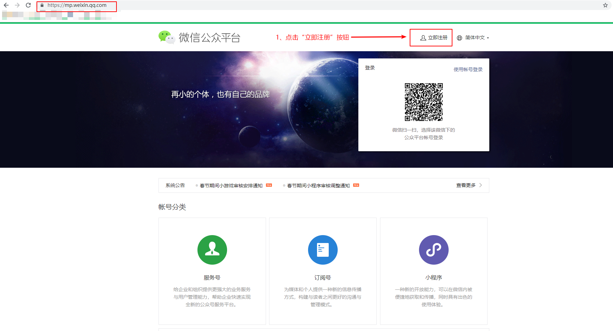

一、小程序注册:   
方式1：使用未在微信公众平台注册过的邮箱激活后填写信息注册

1、进入微信公众平台：https://mp.weixin.qq.com/，点击“立即注册”按钮。

2、注册界面选择“小程序”。如果是注册企业（单位）或组织账号，也可选择服务号，填写社会信用统一代码等信息并打款后可注册成功。服务号功能更全，包含了订阅号和小程序的全部功能。

3、小程序注册界面填写邮箱、密码等信息。

4、填写完信息点击“注册”后邮箱会收到账号激活链接，打开链接激活账号。

5、信息登记界面选择账号主体类型。

5.1 如果注册个人账号需填写身份证等信息。

5.2 如果注册企业、政府等账号，需填写相应的信息并使用对公账户小额打款进行认证。

6、注册完成后每个账号会有一个唯一的appid，后续开发中要使用appid上传代码。在开发管理—>开发设置中可查看appid。

方式二、复用企业（单位）注册的公众号信息快速创建小程序。
1、关注要复用信息的公众号。
2、发送自己的微信号给公众号管理员，邀请你成为公众号运营者。
3、进入微信公众平台：https://mp.weixin.qq.com/，用自己的微信扫描二维码选择关联的公众号账号登录公众号运营平台。

4、登录后在左侧选择广告与服务—>小程序管理可查看改公众号关联的所有小程序。

5、点击“添加”按钮添加小程序。
6、如果已经有小程序账号，选择“关联小程序”，如果没有小程序账号则选择“快速注册并认证小程序”。

7、阅读快速创建小程序说明，勾选“我已明白快速创建小程序的流程，现在开始进行创建”，点击“快速创建”。

8、将二维码发送给公众号管理员进行扫码通过。
9、扫码通过后填写自己的手机号等信息设置小程序管理员。
10、填写完成后每个账号会有一个唯一的appid，后续开发中要使用appid上传代码。在开发管理—>开发设置中可查看appid。
11、

二、小程序信息补充
1、登录小程序账号后，点击首页，补充信息。企业（单位）账号需要进行微信认证，个人账号无需微信认证。

2、填写基本设置信息

3、基本信息填写完成后回到首页下载微信开发者工具并安装（https://developers.weixin.qq.com/miniprogram/dev/devtools/download.html）。

4、安装完成后打开微信扫码登录，按照小程序规范书写代码，也可使用其他编辑器书写代码，微信开发者工具预览效果。
5、微信开发者工具新建小程序项目时，AppId可以使用申请的小程序账号AppId，也可以使用测试号。但上传代码到微信公众平台时必须使用申请的小程序账号AppId，否则无法上传。

6、开发过程中调用后端接口时，若未设置服务器域名，需在微信开发者工具的详情—>本地设置中勾选“不校验合法域名”，否则接口无法调通。小程序发布到线上时一定要设置服务器域名。

7、可在小程序首页设置服务器域名。

8、若在代码中使用了<web-view src=" https://www.xx /"></web-view>组件，还需设置业务域名，否则src中的网址无法打开。web-view组件仅对企业（单位）账号开放，个人账号无法使用。
9、可在小程序首页—>开发—>开发管理设置业务域名。

10、代码开发完后在微信开发者工具中把AppId更改为小程序账号的AppId,点击“上传”。

11、上传后的小程序可点击首页的前往发布找到，但当前版本仅为体验版本，只能扫码授权体验。还需提交给微信团队审核，通过后转为线上版本。

12、审核通过后就可以在微信上搜索到小程序啦！